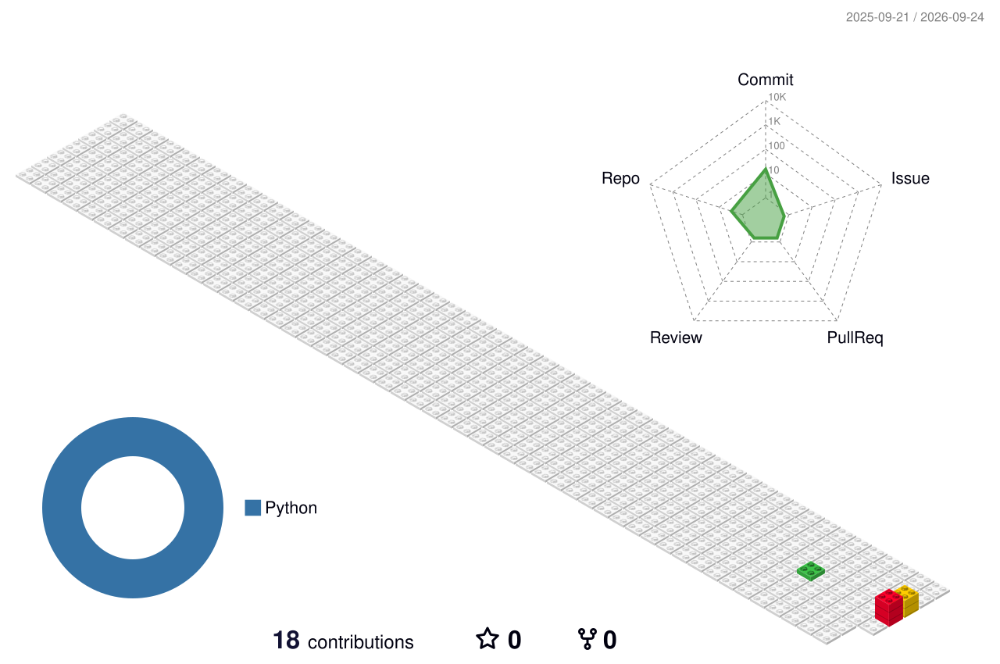

<picture>
  <source media="(prefers-color-scheme: dark)" srcset="https://raw.githubusercontent.com/sun0225SUN/sun0225SUN/e2631be9680678ffb5633f83bc4fe2d5021e680b/assets/images/coding.gif" />
  <source media="(prefers-color-scheme: light)" srcset="https://raw.githubusercontent.com/sun0225SUN/sun0225SUN/e2631be9680678ffb5633f83bc4fe2d5021e680b/assets/images/developer.svg" />
  
</picture>

  

<picture>
  <source media="(prefers-color-scheme: dark)" srcset="./profile/snake-dark.svg" />
  <source media="(prefers-color-scheme: light)" srcset="./profile/snake.svg" />
  
</picture>

# 🙋 Hello

<table width="100%">
<tr><td width="1000">

### 🤺 About Me

嗨，你好，我是 **Alinerml** 👋

在这里记录代码、探索新工具，也把想法一点点变成作品。

**Keep learning. Keep building.**

</td></tr>
<tr><td width="1000">

### 🚀 Code & Projects

- [**minigo**](https://github.com/Alinerml/minigo) · Go
- [**minijava**](https://github.com/Alinerml/minijava) · Java
- [**tiktok**](https://github.com/Alinerml/tiktok) · Java
- [**更多项目 →**](https://github.com/Alinerml?tab=repositories)

</td></tr>
</table>

### 📊 GitHub Stats

<picture>
  <source media="(prefers-color-scheme: dark)" srcset="./profile/stats-dark.svg" />
  <source media="(prefers-color-scheme: light)" srcset="./profile/stats.svg" />
  
</picture>

<picture>
  <source media="(prefers-color-scheme: dark)" srcset="./profile/languages-dark.svg" />
  <source media="(prefers-color-scheme: light)" srcset="./profile/languages.svg" />
  
</picture>

### 🛠️ Tech & Tools

 

### 📅 Contributions Calendar

<table>
<tr>
<td width="50%"></td>
<td width="50%"></td>
</tr>
</table>

### 🏙️ My Contribution City

<picture>
  <source media="(prefers-color-scheme: dark)" srcset="./profile-3d-contrib/profile-night-rainbow.svg" />
  <source media="(prefers-color-scheme: light)" srcset="./profile-3d-contrib/profile-gitblock.svg" />
  
</picture>

**Thanks for stopping by. Happy coding!**

Visual inspiration & linked illustrations: <a href="https://github.com/sun0225SUN/sun0225SUN">sun0225SUN</a> · <a href="./docs/MAINTENANCE.md">About this profile</a>

