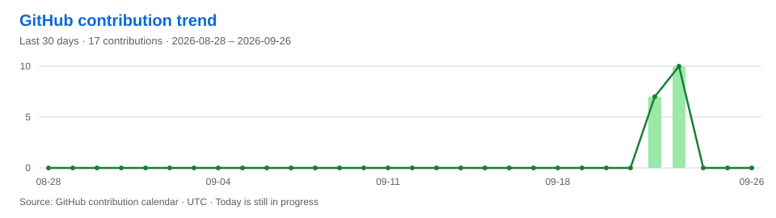
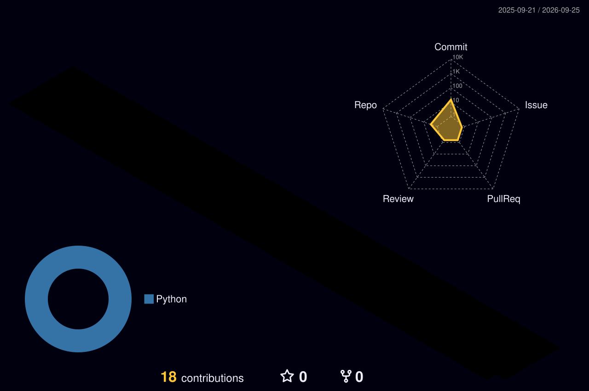
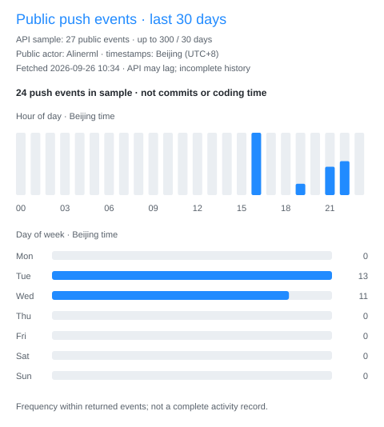
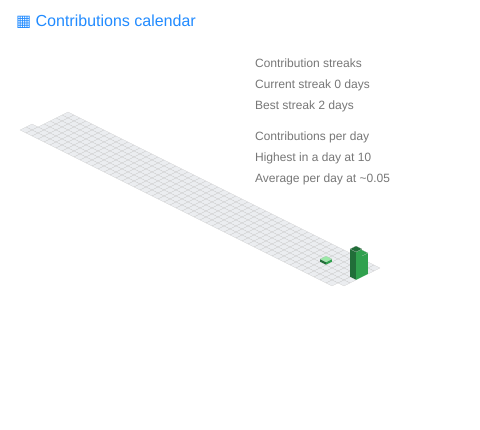
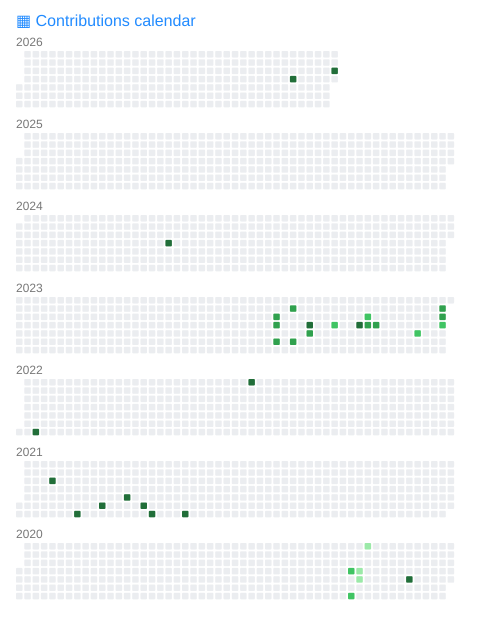
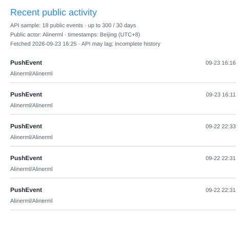

[;Alinerml祝您今天愉快!&center=true&size=27)](https://git.io/typing-svg)

<picture>
  <source media="(prefers-color-scheme: dark)" srcset="https://cdn.jsdelivr.net/gh/sun0225SUN/sun0225SUN@6d4e976b053a33c97b5b0984516217c22af93de5/assets/images/coding.gif" />
  <source media="(prefers-color-scheme: light)" srcset="https://cdn.jsdelivr.net/gh/sun0225SUN/sun0225SUN@6d4e976b053a33c97b5b0984516217c22af93de5/assets/images/developer.svg" height="225px" />
  
</picture>

&nbsp;

  &emsp;
  

<picture>
  <source media="(prefers-color-scheme: dark)" srcset="profile/snake-dark.svg" />
  <source media="(prefers-color-scheme: light)" srcset="profile/snake.svg" />
  
</picture>

#  🙋 Hello

<table>

<tr><td>

### 🤺 About Me

&emsp;&emsp;嗨，你好，我是 Alinerml。在这里记录代码、探索新工具。

&emsp;&emsp;热爱计算机科学和 IT 互联网事业，希望能成为一名优秀的开发者。

&emsp;&emsp;我们正在让这个世界变得更加美好，通过代码的重复使用和延展构建完美体系。

&emsp;&emsp;<strong>We're making the world a better place. Through constructing elegant hierarchies for maximum code reuse and extensibility.</strong>

</td></tr>

</table>

<!--START_SECTION:waka-->
<!--END_SECTION:waka-->

  <picture>
    <source media="(prefers-color-scheme: dark)" srcset="https://readme-jokes.vercel.app/api?hideBorder&bgColor=%23121212" />
    <source media="(prefers-color-scheme: light)" srcset="https://readme-jokes.vercel.app/api?hideBorder&bgColor=%23ffffff" />
    
  </picture>

<picture>
  <source media="(prefers-color-scheme: dark)" srcset="https://streak-stats.demolab.com/?user=Alinerml&theme=dark&hide_border=true" />
  <source media="(prefers-color-scheme: light)" srcset="https://streak-stats.demolab.com/?user=Alinerml&theme=light&hide_border=true" />
  
</picture>

<picture>
  <source media="(prefers-color-scheme: dark)" srcset="profile/stats-dark.svg" />
  <source media="(prefers-color-scheme: light)" srcset="profile/stats.svg" />
  
</picture>

 

<picture>
  <source media="(prefers-color-scheme: dark)" srcset="profile/languages-dark.svg" />
  <source media="(prefers-color-scheme: light)" srcset="profile/languages.svg" />
  
</picture>

 

 

<picture>
  <source media="(prefers-color-scheme: dark)" srcset="profile-3d-contrib/profile-night-rainbow.svg" />
  <source media="(prefers-color-scheme: light)" srcset="profile-3d-contrib/profile-gitblock.svg" />
  
</picture>

<table>
  <tr>
    <td></td>
  </tr>
</table>

<table>
  <tr>
    <td></td>
    <td></td>
  </tr>
  <tr>
    <td></td>
    <td></td>
  </tr>
  <tr>
    <td></td>
    <td></td>
  </tr>
  <tr>
    <td></td>
    <td></td>
  </tr>
</table>

更多 GitHub 活动与统计

 

Layout and decorative assets adapted from [sun0225SUN](https://github.com/sun0225SUN/sun0225SUN). Statistics belong to Alinerml.
